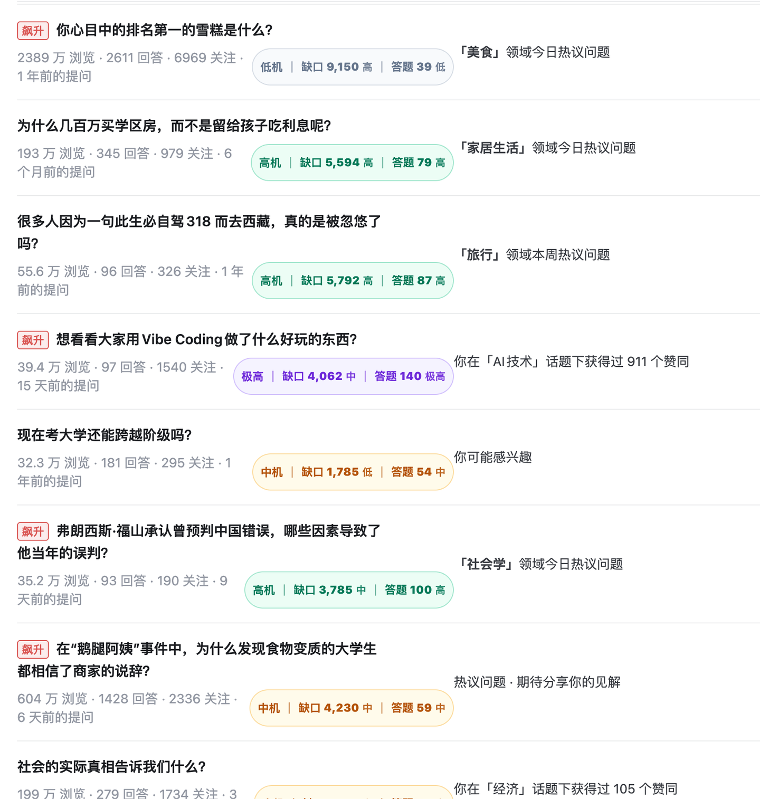
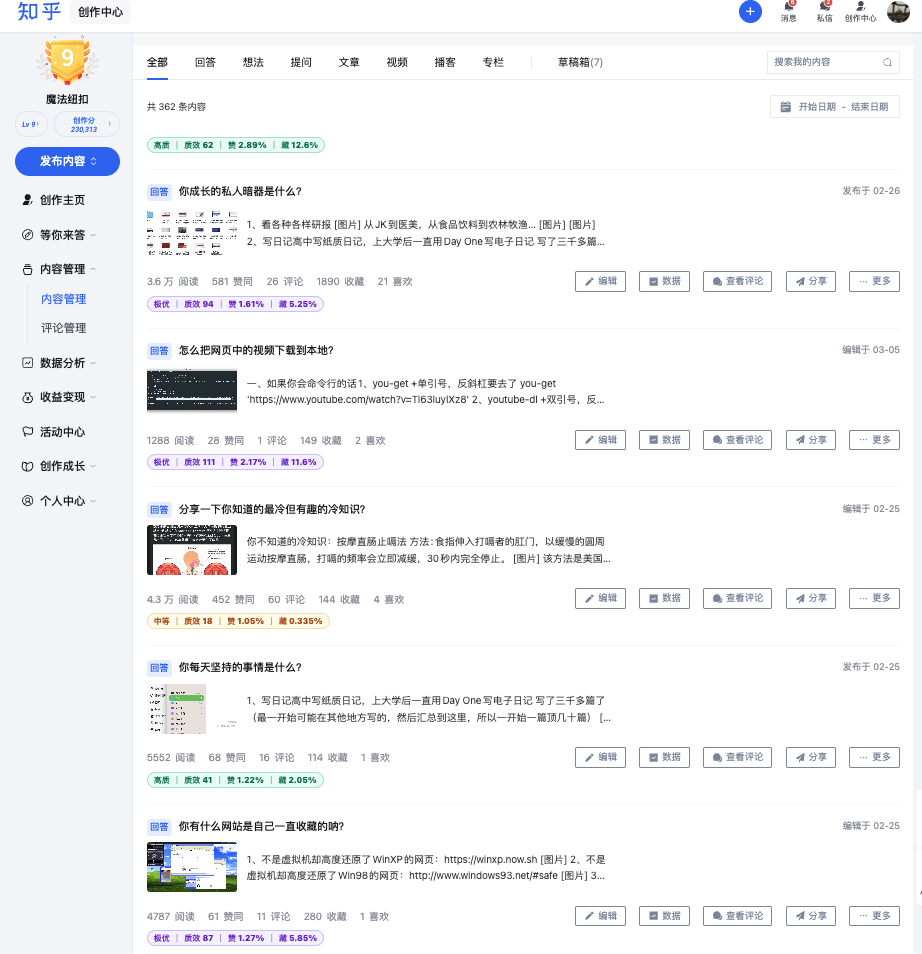

# Zhihu Creator Userscripts

<p align="center">
  
  
  
  
  
  
  
</p>


Tampermonkey userscripts for Zhihu creators: question opportunity scoring and content quality scoring.

知乎创作效率工具箱：一组面向知乎创作者的油猴脚本，帮助你判断哪些问题值得回答，以及评估自己回答的互动质量。

这是一个轻量级、本地运行的小工具箱。它不是自动化刷数据工具，也不会替你操作知乎账号，只是在浏览器本地读取页面上已经展示的数据，并计算一些辅助指标。

## Scripts

| Script                           | 中文名     | 作用               |
| -------------------------------- | ------- | ---------------- |
| Zhihu Question Opportunity Score | 知乎问题机会分 | 判断哪些问题更值得回答      |
| Zhihu Content Quality Score      | 知乎内容质量分 | 评估自己写过的回答 / 文章质量 |

## Preview

### 知乎问题机会分



### 知乎内容质量分



## Install

使用前需要先安装 Tampermonkey / Violentmonkey 等用户脚本管理器。

### 1. 知乎问题机会分

[Install zhihu-question-opportunity-score.user.js](https://raw.githubusercontent.com/kestory/zhihu-creator-userscripts/main/scripts/zhihu-question-opportunity-score.user.js)

脚本文件：

```text
scripts/zhihu-question-opportunity-score.user.js
```

### 2. 知乎内容质量分

[Install zhihu-content-quality-score.user.js](https://raw.githubusercontent.com/kestory/zhihu-creator-userscripts/main/scripts/zhihu-content-quality-score.user.js)

脚本文件：

```text
scripts/zhihu-content-quality-score.user.js
```

## 1. 知乎问题机会分

这个脚本用来辅助判断：

```text
一个知乎问题值不值得写新回答？
```

支持页面：

```text
https://www.zhihu.com/creator*
https://creator.zhihu.com/*
https://www.zhihu.com/question/*
```

脚本会在知乎创作中心推荐问题列表、普通知乎问题页中，自动显示问题的「缺口值」和「答题分」。

显示示例：

```text
高机会｜缺口 8,693 高｜答题分 115 高
```

### 核心指标

#### 缺口值

```text
缺口值 = 浏览数 / 回答数
```

缺口值越高，说明这个问题可能存在：

```text
看的人多，回答相对少
```

也就是有一定的内容供需缺口。

#### 答题分

答题分不是简单地看 `浏览数 / 回答数`，而是综合考虑：

```text
浏览数、关注数、回答数、问题新鲜度、低流量池惩罚
```

简单理解：

```text
浏览越高，说明需求越大；
关注越高，说明还有人等答案；
回答越多，说明竞争越激烈；
问题越新，越可能还有推荐流量；
浏览太低，即使缺口高，也会被适当降权。
```

答题分越高，说明这个问题从数据上看越值得认真研究。

### 机会等级

| 等级   | 含义           |
| ---- | ------------ |
| 极高机会 | 值得优先点开研究     |
| 高机会  | 值得考虑写        |
| 中机会  | 看具体题目和自己是否擅长 |
| 低机会  | 数据层面的吸引力较弱   |

## 2. 知乎内容质量分

这个脚本用来辅助复盘：

```text
自己写过的回答 / 文章，互动质量怎么样？
```

支持页面：

```text
https://www.zhihu.com/creator/manage/creation*
```

脚本会在知乎创作中心内容管理页中，自动给自己写过的回答 / 文章显示「质效分」。

显示示例：

```text
高质｜质效 50｜赞 1.23%｜藏 2.06%
```

### 核心指标

#### 加权互动

```text
加权互动 = 赞同 × 1 + 评论 × 2 + 收藏 × 1.5 + 喜欢 × 0.5
```

简单理解：

| 指标 |  权重 | 含义          |
| -- | --: | ----------- |
| 赞同 |   1 | 基础认可        |
| 评论 |   2 | 引发讨论        |
| 收藏 | 1.5 | 实用价值 / 长尾价值 |
| 喜欢 | 0.5 | 轻量互动        |

#### 质效分

```text
质效分 = 1000 × 加权互动 / (阅读数 + 1000)
```

简单理解：

```text
质效分 ≈ 每 1000 次阅读能带来多少加权互动
```

分母里加 `1000`，是为了避免小样本过度夸张。

比如只有几十阅读、几个赞，比例看起来很高，但还不能说明它稳定优秀，所以分数会被适当压低。

### 内容质量等级

| 等级  |   分数 | 含义                |
| --- | ---: | ----------------- |
| 极优  | ≥ 80 | 代表作 / 爆款潜质，值得认真复盘 |
| 高质  | ≥ 40 | 表现不错，可以考虑继续写类似题   |
| 中等  | ≥ 15 | 正常发挥              |
| 待观察 | < 15 | 样本较小，或互动转化偏弱      |

「待观察」不等于低质。

它可能有两种情况：

```text
1. 阅读很多，但赞同、收藏、评论较少，说明互动转化偏弱；
2. 阅读还很少，样本不足，暂时不好判断。
```

## Design Principles

本项目尽量保持简单、安全、透明。

脚本不会：

```text
读取 Cookie；
上传任何数据；
调用外部服务器；
自动点赞；
自动评论；
自动关注；
自动发布内容；
批量请求知乎接口；
绕过知乎权限或限制。
```

脚本只会：

```text
读取当前页面已经展示出来的数字；
在浏览器本地计算指标；
在页面上增加辅助展示标签。
```

## 适用人群

适合经常在知乎写回答、做内容复盘、寻找选题灵感的创作者。

它不能保证一个问题一定会火，也不能判断内容的绝对质量，只是提供一个数据辅助视角。

## Disclaimer

本项目仅用于个人学习、内容复盘和浏览器本地增强展示。

脚本提供的所有分数都只是辅助指标，不构成任何创作、运营、商业或投资建议。

请合理使用，并遵守知乎平台规则。

## Star History

[](https://www.star-history.com/#kestory/zhihu-creator-userscripts&Date)


## License

MIT License
